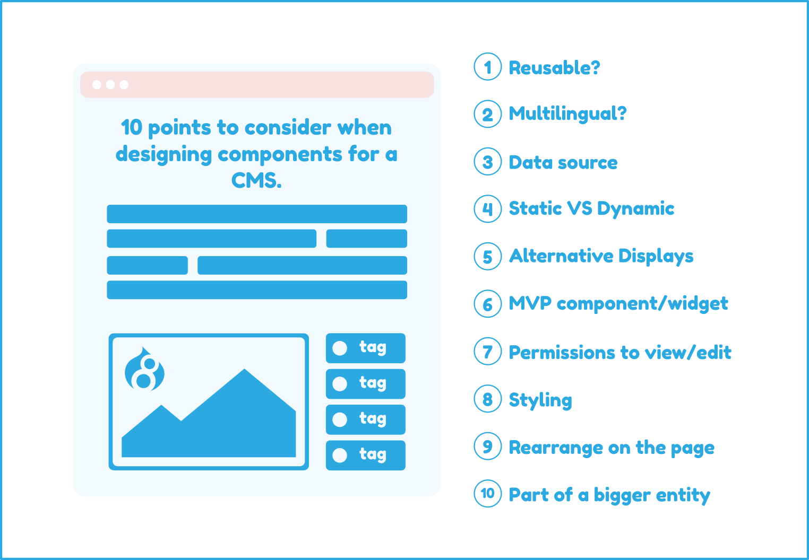

# UI design

## 10 Questions to answer when designing UIs for a CMS like Drupal

The questions refer to each element/component designed. In general, the UI design should answer to 4 questions:

- What (data, language etc)
- Where (position, part of another component etc)
- Who (permissions)
- How (skinning, display modes etc)

I really like designs that **contain these information** within the components through signs or plain text.

1. Multilingual
2. Reusable
3. Data source
4. Static vs Dynamic
5. Alternative displays
6. MVP vs Final component
7. Access permissions (CRUD)
8. Styling/skinning options
9. Ability to rearrange on the layout
10. Part of a bigger component



## Design System folder structure

```text
.
├── 00-base/
├── 01-atoms/
├── 02-molecules/
├── 03-organisms/
├── 04-templates/
├── 05-pages/
├── _global-data/
├── images/
├── README.md
├── package.json
```

## Design System inventory

### Template examples

- Home Page
- Section Landing Page
- Basic Content Page
- Event Landing Page
- Event Detail Page
- Article Landing Page
- Listing Page
- Search Results Page

### Global Components examples

- Header
- Footer
- Subnavigation
- Breadcrumbs
- Share
- Alerts

### Page Components examples

- 50/50 Banner
- Accordion Set
- Article Search Header
- CTA Banner
- Event Banner
- Event Cards
- Forms
- Hero Banner
- Icon Cards
- Info Cards
- Map
- Media Gallery
- Persona Selector
- Rich Text Editor
- Search Results Cards
- Stats Cards
- Testimonial Cards
