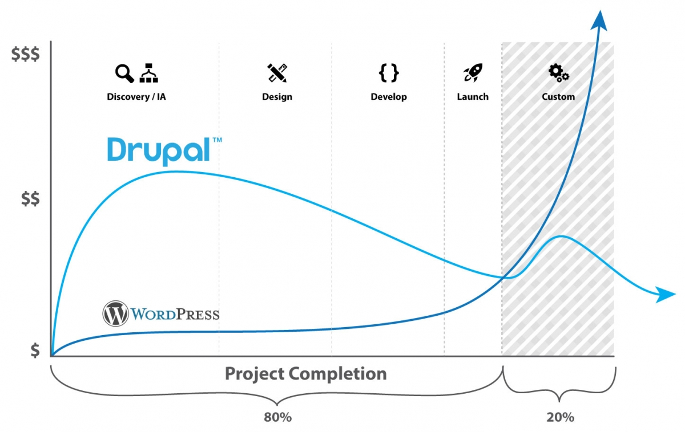

# Selling Drupal
> A notebook about "selling" Drupal to potential clients, companies, organizations etc. Or, alternatively, a list of Drupal advantages against other solutions.

## What to consider
- Sell Drupal as a "Story", as a narative.
- Sell Drupal as an approach, as a philosophy.
- Drupal has the flexibility to adapt on custom needs (eg a business logic).
- Try to talk about the customer Roadmap and plans and why Drupal can support these.
- Demonstrate the success of others on the same industry due to Drupal (similar showcases).
- Sell what Drupal can do and no other tool can do easily (eg full structured Content management).
- Sell the long term strategy.
- Drupal minimazes client risks (Drupal is not a risky solution).
- Emphasize to the (open source) license only when there is a migration from a commercial product to Drupal.
- Promote the integration with 3rd party tools (so customers don't feel to be restricted by Drupal).
- Drupal (usually) costs more initially but has lower cost long term.
- Instead of paying for a commercial license pay to extend or make better your solution.
- Try to learn what is the current opinion the customer has about Drupal.
- Try to learn how is the customer now solving problems (what system is using, who manages it, what are the issues, what is the cost etc).
- Show other clients feedback (testimonials) about Drupal.

## What to avoid
- Don's sell what it does or how it works.
- Don't try to present Drupal as a box of lego pieces (do it yourself toy) but as a complete toy (a ready to play car of legos).
- Don't be too generic about Drupal features.
- Don't compare to others except if there is already a system to replace.
- Don't sell Drupal as a product.
- Avoid demos of any type.
- Avoid showing large tables of Drupal capabilities.
- Don't talk about open source vs closed source advantages.
- Don't say that Drupal is a cheap solution or cheaper than other solutions.
- Don't talk about the community, free modules, issues and other Drupal* things.
- Don't use Drupal specific terminology. Speak with end-user functionality terms.

## Keywords to use in the context
- adapted software
- open software
- business logic
- long term
- extensible
- flexible
- security
- corporate support
- user permissions
- content structure
- workflow
- investment
- customization

## Slogans to use
- Pay for the customization, not for the license
- Get only what you need. Nothing less, nothing more.
- Fits perfectly on your needs.
- Adapted to your needs.
- A long term investment.
- Grows as you grow.
- Built for the "hard".

## Drupal Distributions
- Before giving an estimation about a project search carefully on Drupal.org because a [Distribution](https://www.drupal.org/project/project_distribution) may already exist there to fit your needs. 

Distributions like [Lightning](https://www.drupal.org/project/lightning), [Thunder](https://www.drupal.org/project/thunder) [Rain](https://www.drupal.org/project/rain), [Varbase](https://www.drupal.org/project/varbase) etc could be an option for generic content websites.

## Sources & links
- [Drupal: Agency Marketing](https://www.drupal.org/community/agency-marketing)
- [Drupal Initiative Material (google drive)](https://drive.google.com/drive/folders/1ZkRt80-XuEmAIka_w3SLv8stc4zlaFwG)
- [The ultimate guide to Drupal 8 (pdf)](https://www.acquia.com/sites/acquia.com/files/documents/2019-05/UltimateGuideToDrupal_8.7.pdf)
- [State of Drupal (10/2019)](https://dri.es/state-of-drupal-presentation-october-2019)
- [drupal.org/8](https://www.drupal.org/8)
- [Why Drupal 8](https://www.drupal.com/why-drupal-8)
- [Who uses Drupal - Showcases](https://www.drupal.com/showcases)
- [Drupal Brand and logo guidelines 2018 (pdf)](https://drive.google.com/file/d/1sgVB1xOeLxnBNfuke73W86f1zrztttGQ/view)
- [Selling Drupal (Youtube list)](https://www.youtube.com/playlist?list=PLu2UqJVurcrveBrIuRUvQPLld2Spg_Hzg)
- [Selling Drupal to the Enterprise](https://vimeo.com/55590561)
- [Is it time to give Drupal another look? (Stack Overflow Blog](https://stackoverflow.blog/2020/06/23/is-it-time-to-give-drupal-another-look)
- [drupalsites.net](https://drupalsites.net)

---

- [Palantir.net's Guide to Digital Governance](https://www.palantir.net/node/731)
- [stackshare.io/drupal](https://stackshare.io/drupal)
- [Complete Guide on Drupal Security (2018)](https://www.keycdn.com/blog/drupal-security)
- [Acquia a leader in 2019 Gartner Magic Quadrant for Web Content Management (2019)](https://dri.es/acquia-a-leader-in-2019-gartner-magic-quadrant-for-web-content-management)
- [Have We Reached Peak Drupal? (2017)](https://www.previousnext.com.au/blog/have-we-reached-peak-drupal)
- [Svg glyphs, illustrations and icons related to Drupal CMS (github)](https://github.com/theodorosploumis/drupal-glyphs)

## Other useful material

---

