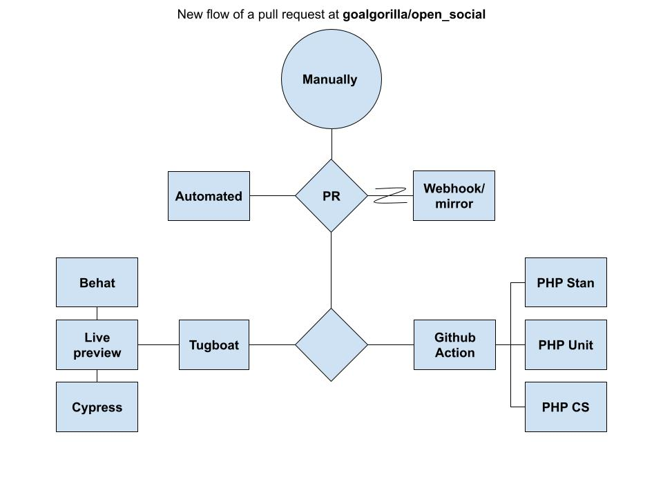

# Drupal Testing and CI/CD

> A simple structure of testing tasks and tips for Drupal.

## Testing types

- **Unit testing** is a kind of test in which minor testable parts or units of an application, called units, are individually and independently tested for proper operation.
- **Integration Testing** has a focus on the interaction between components or systems. This kind of testing means we’re checking the interplay of the units and how they’re working together.
- **End-To-End Testing**, or E2E testing or **UI testing**, means that actual user interactions are simulated by the computer; in doing so, E2E testing should include as many functional areas and parts of the technology stack used in the application as possible (nightwatch, cypress, behat etc).
- **Visual Testing** is the process of checking the visible output of an application and comparing it to the expected results. Put another way, it helps find "visual bugs" in the appearance of a page or screen different from purely functional bugs.
- **Static analysis** is not precisely testing, but I think it’s essential to mention it here. You can imagine it working like a spelling correction: It debugs your code without running the program and detects code style issues. This simple measure can prevent many bugs.
- **Functional testing**
- Speed/performance testing (lighthouse score)
- JS testing with nightwatch, cypress etc
- Browser support testing
- A11y testing
- Stress testing (jmeter, artillery, k6 etc)

## CI/CD

- Build docker image
- Update Gitpod workspace docker image (prebuild, if exists)
- Create a git release with Release.txt (eg on GitHub)
- Deploy on STAGE/PRODUCTION etc
- Generate a sanitized database backup from Production
- Get screenshots (eg for different devices and screen sizes)
- Send notifications
- Update testing results budges to README

## Guidelines

- If you want to test **class methods** write "[Unit tests](https://www.drupal.org/docs/automated-testing/phpunit-in-drupal)".
- If you want to test **Module APIs** write "[Kernel tests](https://api.drupal.org/api/drupal/core%21tests%21Drupal%21KernelTests%21KernelTestBase.php/class/KernelTestBase/)".
- If you want to test Functional (Web UI) without JS needs write "[Browser tests](https://www.drupal.org/docs/automated-testing/phpunit-in-drupal/phpunit-browser-test-tutorial)".
- If you want to test Functional (Web UI) that involve JS write "[Javascript tests](https://www.drupal.org/docs/8/phpunit/phpunit-javascript-testing-tutorial)", [nightwatch tests](https://www.drupal.org/docs/automated-testing/javascript-testing-using-nightwatch), "[Behat tests](https://behat-drupal-extension.readthedocs.io)", [cypress.io tests](https://www.cypress.io) etc.
- If you want to do **stress tests** use jmeter, artillery, k6 etc.

## Examples

What to test for a Drupal project:

- dev\* and \*\_ui modules are disabled on Production
- A user of Role X can submit a node form of a bundle
- A user of Role X can view a node of a bundle
- New site can be installed from configuration and/or demo content
- REST/JSON API (CRUD operations)
- REST/JSON API (get Nodes single, list, filtering, pager)
- REST/JSON API (get Views)
- REST/JSON API (get Blocks)
- REST/JSON API (get Configuration values)
- REST/JSON API (get Settings variables)
- REST/JSON API (stress test)
- REST/JSON API (security test)
- REST/JSON API (Permissions)
- Functionality (eg module API, test functions)
- Permissions (eg a Drupal user can access a page)
- Integration (eg PHP versions, dependencies versions, Drupal core versions)
- UI (Expected behavior on a Drupal page)
- Code validation according to standards
- Entity fields machine name patterns
- Broken JS functionality
- CKEditor buttons exist
- System: can create a new release/tag
- System: take a Prod database backup
- System: sanitize database
- System: rollback site to a snapshot
- drupal_rector & upgrade_status report

## UAT examples for Drupal

- View a node (for each bundle)
- Edit a node (for each bundle)
- View a list (views)
- User login works
- Webform submissions work
- Search works
- Cron task works
- SMTP and mail system works
- There are no JS errors on console

## Other useful material

- [Drupal.org - Automated testing](https://www.drupal.org/docs/automated-testing)
- [Drupalize.me - Automated Testing in Drupal](https://drupalize.me/series/automated-testing-drupal)
- [Lullabot - An Overview of Testing in Drupal 8, 2017](https://www.lullabot.com/articles/an-overview-of-testing-in-drupal-8)
- [UI Testing: A Getting Started Guide and Checklist, 2022](https://applitools.com/blog/ui-testing-guide/)

